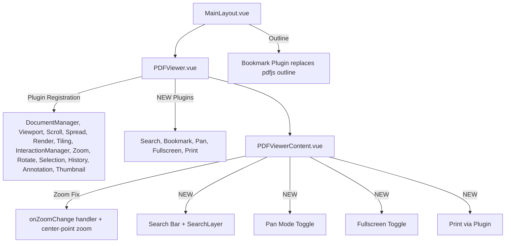

## Product Overview

A comprehensive analysis and improvement plan for the PDF viewer in MarkPDFDown, a cross-platform PDF note-taking Tauri application. The plan addresses critical zoom/scroll bugs discovered via Tauri MCP deep analysis, and integrates high-value unused @embedpdf plugins to enhance the PDF reading experience.

## Core Features

### Bug Fixes

- **Zoom position preservation**: When zooming in/out via toolbar buttons, the viewport should maintain focus on the same content area instead of keeping the raw pixel scroll position. The zoom plugin's `ZoomChangeEvent` already provides `desiredScrollLeft`/`desiredScrollTop` and `center` point — toolbar zoom calls should leverage these.
- **Non-continuous mode CSS selector fix**: The `.non-continuous` class is conditionally applied to the viewport, but CSS selectors for hiding non-current spread rows may fail under certain DOM structures. Ensure reliable visibility toggling of spread rows.
- **Page turn cooldown optimization**: Reduce the 300ms cooldown to feel more responsive, or use a velocity-based approach for rapid page flipping.
- **Diagonal scroll handling in non-continuous mode**: Fix edge case where diagonal scrolls (deltaX and deltaY both non-zero) may produce unexpected behavior.

### New Plugin Integrations

- **Full-text search**: Integrate `@embedpdf/plugin-search` with a search bar UI in the toolbar, SearchLayer overlay on pages, result navigation (next/previous), and match count display.
- **PDF bookmarks/outline**: Integrate `@embedpdf/plugin-bookmark` to load PDF bookmark tree and display it in the existing outline panel, replacing the current pdfjs-dist based outline extraction.
- **Pan mode**: Integrate `@embedpdf/plugin-pan` for drag-to-pan viewport navigation, especially useful when zoomed in. Add a hand/grab toggle button in the toolbar.
- **Fullscreen mode**: Integrate `@embedpdf/plugin-fullscreen` with a fullscreen toggle button in the toolbar.
- **Native print**: Replace the current `window.open()` print workaround with `@embedpdf/plugin-print` for proper native print dialog support.

### Zoom Plugin Enhancement

- Configure `minZoom`, `maxZoom`, `zoomStep`, and `zoomRanges` for better zoom control boundaries.
- Add MarqueeZoom (area zoom) capability to the toolbar.

## Tech Stack

- **Framework**: Vue 3 + TypeScript (Composition API with `<script setup>`)
- **UI Framework**: Quasar Framework v2 (existing)
- **PDF Engine**: @embedpdf v2.6.0 (pdfium-based, already installed with all plugins)
- **Build**: Quasar CLI + Vite, Tauri v2 for desktop
- **State Management**: Pinia (existing)

## Implementation Approach

The implementation follows a layered strategy:

1. **Fix zoom position preservation** by subscribing to `onZoomChange` events from the ZoomScope, which already provides `desiredScrollLeft`/`desiredScrollTop` calculated by the library. The current toolbar zoom calls `zoom.zoomIn()`/`zoom.zoomOut()` without a center point — we need to pass the viewport center as the zoom focus point so the library computes correct scroll targets. After zoom, apply `desiredScrollTop`/`desiredScrollLeft` to the viewport element.

2. **Fix non-continuous mode** by ensuring the `.non-continuous` class is always correctly applied and the CSS selectors match the actual DOM structure. The existing `markCurrentSpread()` logic is sound but needs robustness improvements — add a fallback re-check after zoom changes since zoom can alter spread dimensions.

3. **Register new plugins** in `PDFViewer.vue` alongside existing plugin registrations, using `createPluginRegistration()` with the same pattern. All new plugins (Search, Bookmark, Pan, Fullscreen, Print) are already installed in node_modules.

4. **Build search UI** as a collapsible search bar in the toolbar area with Quasar input + navigation buttons, using `useSearch()` hook for state and `SearchLayer` component layered on each page.

5. **Integrate bookmarks** by replacing the current `getPdfOutlineItems()` (which uses pdfjs-dist) with the native `useBookmarkCapability()` from @embedpdf, providing more accurate and consistent bookmark data.

**Key technical decisions**:

- Use the library's built-in `desiredScrollLeft`/`desiredScrollTop` from `ZoomChangeEvent` rather than manually computing scroll ratios — this is more accurate and handles edge cases like fit-width/fit-page modes.
- Pass viewport center point (`{vx, vy}`) to `zoom.zoomIn()` as a `Point` parameter — the `ZoomScope.requestZoom(level, center?)` API supports this.
- Keep all new plugin components co-located in `PDFViewerContent.vue` to maintain the existing single-file architecture.

## Implementation Notes

### Performance

- The `onZoomChange` subscription fires once per zoom operation — minimal overhead. The handler only reads `desiredScrollTop`/`desiredScrollLeft` and applies them.
- Search plugin runs on the pdfium worker thread — UI stays responsive. Use `loading` state from `SearchDocumentState` to show a spinner.
- Bookmark loading is a one-time async call per document — cache results in a ref.
- Non-continuous mode `markCurrentSpread()` already uses cached bounds to avoid forced reflow — zoom handler should call `refreshSpreadBounds()` after zoom settles.

### Backward Compatibility

- All toolbar additions use Quasar `q-btn` with the same `flat dense size="sm"` pattern.
- New plugins are additive — no existing plugin configuration changes (except adding `minZoom`/`maxZoom` to ZoomPluginConfig).
- Print and download functions are enhanced, not replaced — fallback to current behavior if plugin fails.

### Blast Radius Control

- Non-continuous mode fixes are isolated to `PDFViewerContent.vue` CSS and the `handleWheel`/`markCurrentSpread` functions.
- Plugin registrations added in `PDFViewer.vue` are independent — removing one doesn't affect others.
- Search UI is conditionally rendered only when search is active.

## Architecture Design

### Module Relationships



### Data Flow for Zoom Fix

1. User clicks Zoom In/Out button
2. Button calls `zoom.requestZoom(level, viewportCenter)` with computed center point
3. ZoomPlugin computes new scale + `desiredScrollTop`/`desiredScrollLeft`
4. `onZoomChange` callback receives event with scroll targets
5. Handler applies `viewportRef.scrollTop = event.desiredScrollTop`
6. In non-continuous mode: `refreshSpreadBounds()` + `markCurrentSpread()` called after zoom

## Directory Structure

```
src/
├── components/
│   ├── PDFViewer.vue           # [MODIFY] Register SearchPlugin, BookmarkPlugin, PanPlugin, FullscreenPlugin, PrintPlugin. Add minZoom/maxZoom/zoomStep to ZoomPluginConfig.
│   ├── PDFViewerContent.vue    # [MODIFY] Major changes: (1) Fix zoom position preservation via onZoomChange + center-point zoom. (2) Add search bar UI with SearchLayer on pages. (3) Add pan mode toggle, fullscreen toggle, print via plugin. (4) Fix non-continuous CSS and cooldown. (5) Reduce page turn cooldown.
│   └── SearchBar.vue           # [NEW] Dedicated search bar component with query input, match count, next/prev navigation, case-sensitive toggle. Uses useSearch() hook. Emits search state for SearchLayer integration.
├── services/
│   └── outline/
│       └── pdfOutline.ts       # [MODIFY] Add alternative bookmark-plugin-based outline extraction method that can be used when @embedpdf bookmark plugin is available, keeping pdfjs fallback.
└── types/
    └── index.ts                # [MODIFY] No changes needed — existing PDFSettings type is sufficient.
```

## Key Code Structures

```typescript
// Zoom position fix — center point computation for toolbar zoom
interface ViewportCenter {
  vx: number; // viewport-relative X center
  vy: number; // viewport-relative Y center
}

function getViewportCenter(): Point {
  const vp = viewportRef.value;
  if (!vp) return { vx: 0, vy: 0 };
  return {
    vx: vp.clientWidth / 2,
    vy: vp.clientHeight / 2,
  };
}

// Usage: zoom.requestZoom(newLevel, getViewportCenter())
// Then in onZoomChange handler:
// viewportRef.scrollTop = event.desiredScrollTop;
// viewportRef.scrollLeft = event.desiredScrollLeft;
```

## Agent Extensions

### Skill

- **vue**
- Purpose: Leverage Vue 3 Composition API best practices for implementing new components (SearchBar.vue) and modifying existing viewer components with proper reactive patterns, lifecycle management, and hook composition.
- Expected outcome: Clean, idiomatic Vue 3 code that follows project conventions with proper TypeScript typing, ref/computed usage, and watcher cleanup.

### MCP

- **tauri**
- Purpose: After implementation, use Tauri MCP to verify the zoom position fix works correctly, test search functionality in the running app, and validate non-continuous mode rendering.
- Expected outcome: Visual confirmation via webview_screenshot and DOM verification via webview_find_element that zoom preserves scroll position, search highlights appear, and non-continuous mode toggles correctly.

### SubAgent

- **code-explorer**
- Purpose: Deep exploration of @embedpdf plugin internals when needed during implementation to understand exact API signatures, event payloads, and component prop requirements.
- Expected outcome: Accurate API usage without guesswork, ensuring all plugin integrations work correctly on first attempt.